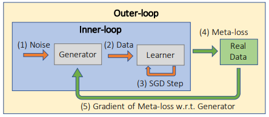
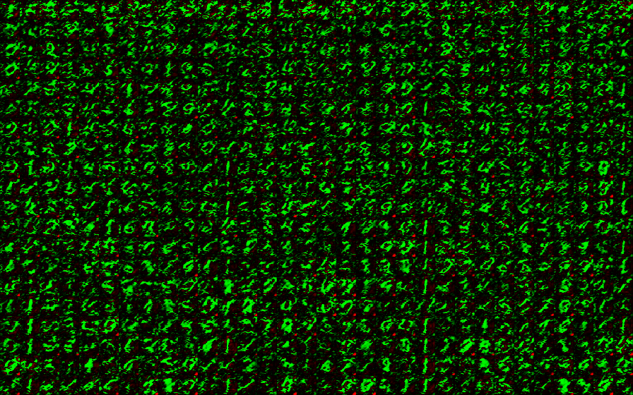
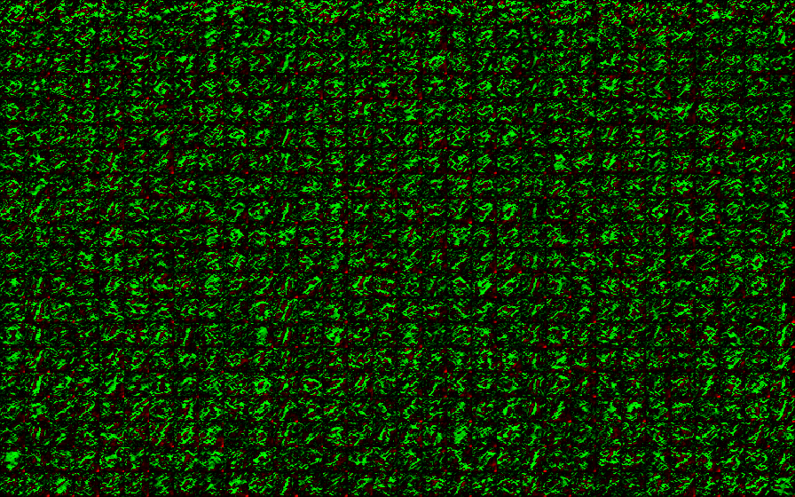
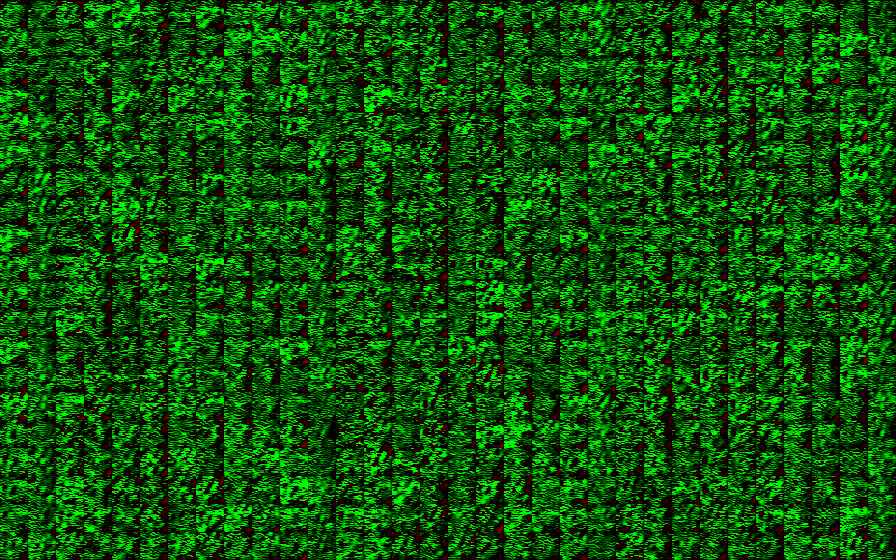
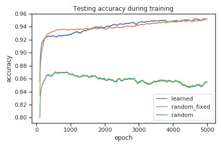
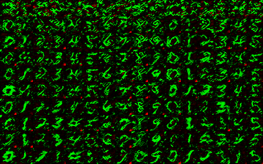
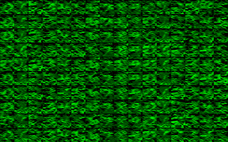

# GTN implementation

Partial implementation of [Generative Teaching Networks](https://arxiv.org/abs/1912.07768) \
MNIST Teacher/Learner was implemented using [PyTorch](https://pytorch.org/) and [higher](https://github.com/facebookresearch/higher)
with aim to confirm and further investigate curriculum generation properties of GTN

### Notes: 
 * Weight Normalization and gradient checkpointing were not implemented as not being necessary - 
learning showed almost no variance and model fit into 11GB of GPU memory
 * BatchNorm and Kaiming initialization were necessary for stable learning

## GTN overview
GTN is composed of two networks (both uses CNN + linear layers):
 * teacher - takes random vectors as input and produces MNIST-like images
 * learner - learns to classify images produced by teacher

GTN is learnt using meta-learning setup, using two loops:
 * inner-loop - "normal" learning - learner learns to classify images produced by teacher, teacher is not updated
 * outter-loop - meta-learning - learnt learner is evaluated on real MNIST dataset, 
                 final loss is computed and backpropagated thru unrolled inner-loop steps 
                 back to the teacher which is updated (by meta gradients)  

Image taken from [paper - Figure 1(a)](https://arxiv.org/abs/1912.07768):\
 

## Results

Three experiment configuration were run:
 * batch_size: 32, inner_loop_steps: 20 
 * batch_size: 32, inner_loop_steps: 10 
 * batch_size: 16, inner_loop_steps: 10 

For each configuration three variants of GTN were tested, varying in input data of the teacher network:
 * "learned" - input tensor was initialized randomly and learned as parameters of teacher network
 * "random_fixed" - input tensor was initialized randomly
 * "random" - input tensor was random for each batch of inner-loop iteration

resulting in total of 9 experiments.

teacher_input has dimension [inner_loop_steps, batch_size, 64]

### Experiment A: batch_size: 32, inner_loop_steps: 20

In order to confirm that teacher learned a curriculum, teacher input tensor were shuffled (by the first dimension - 
order in which inputs were presented to learner during inner loop was randomized).

Chart shows that both “learned” and “random_fixed” variants suffered a big accuracy drop due to the shuffling, 
while “random” was not affected. An explanation for this behavior is that both “learned” and “random_fixed” developed 
a curriculum (ordering of data samples presented to learner) that improves the accuracy. “learned” was designed with 
this property in mind, but “random_fixed” was a surprise, a curriculum is encoded in teacher weights.

Images produced by teacher - variant "learned"\

Images produced by teacher - variant "random_fixed"\

Images produced by teacher - variant "random"\

### Experiment B: batch_size: 32, inner_loop_steps: 10

Images produced by teacher - variant "learned"\
\
Images produced by teacher - variant "random_fixed"\
\
Images produced by teacher - variant "random"\
\

### Experiment C: batch_size: 16, inner_loop_steps: 10

Images produced by teacher - variant "learned"\
\
Images produced by teacher - variant "random_fixed"\
\
Images produced by teacher - variant "random"\
\

### Discussion

* GTN results on MNIST dataset was reproduced with similar performance, compare

Image taken from [paper - Figure 1(c)](https://arxiv.org/abs/1912.07768):\

and 

Experiment A results\

lower accuracy of our result is due to lower batch_size (32 in our experiment vs 128 in GTN paper) and possibly due to 
some missing features and fine tuning - like weight normalization and gradient checkpointing.

* It was shown that teacher created a curriculum
* Note the nice [gradual images](#experiment_b_learned) generated by "learned" teacher in the Experiment B

## How to Install

Requires python version >= 3.7

1. `pip install -r requirements.txt`
2. Install [higher library](https://github.com/facebookresearch/higher)
3. Run local sacred/omniboard by 
    1. Install [Docker](https://www.docker.com/) and [Docker Compose](https://docs.docker.com/compose/install/)
    2. `cd sacred`
    3. `docker-compose up -d`
    4. Open `localhost:9000` in browser (note port 9000 can be changed in `sacred/docker-compose.yml`)

## How to Run

Run single experiment using `experiments/mnist_experiment.py` file. \
Run multiple experiments using `experiments/run_tasks.py` - current setup will replicate presented results. \
View results using omniboard or `experiments/ntb_result_analyzer.ipynb` notebook - running all cells will generate 
images and charts presented in results (sacred run ids have to be changed)
